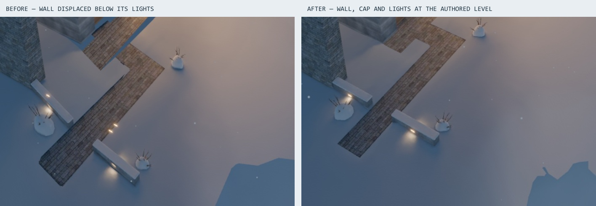

# Reine's west wall (#104)

## Root cause

The wall survives the Blender build. Decoding the committed `main` GLB finds concrete faces and a snow cap in both west-wall segments, including the far segment at y −9 to −7. Its two lights also survive. Culling and the baked snow field do not remove this segment.

The displacement happens in `lib/scene/platform.ts`, after loading the bake. `plinthHeight` used the distance to **another plinth's edge** to force the current plinth onto the slope. Inside any neighbour's rectangle that weight was 1, even when the current plinth was much deeper inside its own rectangle. Reine's far wall overlaps Lyngen's outer plinth band: at x −7.85, y −8 it is 9.60 m inside Reine's edge and only 1.58 m inside Lyngen's. The old calculation nevertheless displaced Reine's ground by −1.9904 m.

`fitSite` applies the same displacement to the wall, its cap and the Snow Shrubs, while the set-in lights in `downlights` keep their baked positions. That explains the floating pair. The far wall is displaced below them and can fall outside the selected camera's frame; it is not deleted. Reine's near piece, path and part of its terrace were also pulled down.

The fix blends around the boundary where the plinths trade ownership, using the **difference between their edge distances**. The deeper plinth preserves its ground and Site Works; the losing plinth stays below both the slope and the winner's lowest fitted ground. This keeps the overlap seam smooth even when the winning House stands below the slope. The builder and the House records need no change.

## Live before / after

Both captures select Reine and use the same scripted orbit, at 1600 × 1600. The taller viewport includes the displaced far piece in the before shot, below the two floating lights. The after shot uses the completed final bake: the wall and cap meet the two light slots, with the Snow Shrub at the end. The near piece and path also return to their authored levels. Separate crops: [before](./before.jpg), [after](./after.jpg).

## Regression checks

`bun test tests/unit/lib/scene/site-fit.test.ts` loads the four real GLBs with meshopt's quantization transforms, as the Scene does. It checks both wall pieces and caps survive the bake, then checks the far piece's vertices keep the set-in lights' datum. On `main`, presence passes and the datum test fails with a −1.7081 m displacement. With the fix both pass.

`terrain.test.ts` also covers a higher plinth overlapping a lower neighbour's outer band, the smooth ownership transition, the terrain remaining below the visible plinth, and the losing plinth remaining hidden.

## Every House's Site Works

The audit decoded each House's committed `site` mesh and checked the record's wall segments and caps, treads, cheeks, path runs, aprons and terraces for surface vertices of the expected material and height. It compared the old and new live displacement at each piece's four corners and centre. All pieces have baked surfaces. Details are in [site-audit.json](./site-audit.json).

It also compared the displacement of every baked Site Works vertex, including the Snow Shrubs: all 2,833 Lyngen, 2,281 Senja and 1,069 Kvaløya vertices are unchanged. Reine has 1,166 affected vertices out of 1,433, moving by up to 2.3080 m. See [site-vertex-changes.json](./site-vertex-changes.json).

| House | Pieces checked | Effect of this fix |
| --- | ---: | --- |
| Lyngen | 22 | No change to its Site Works. The path's small existing bend at its own plinth edge remains. |
| Senja | 21 | No change to its Site Works, including all 16 treads and both cheeks. |
| Kvaløya | 3 | No change to its wall, cap or terrace. Its wall's small existing bend at its own plinth edge remains. |
| Reine | 8 | Both wall segments, their caps, all three path slabs and part of the terrace return to their authored levels. The far wall's outer end retains about 0.013 m of its own plinth-edge bend. |

Only Reine needs the issue's requested final bake. The other Houses' baked geometry is unchanged by this runtime fix.

## Final bake and download

Ran `bun run houses:bake --mode final --force reine`, with only Reine in the command and no browser measurement running. [final-bake.json](./final-bake.json) records the completed 256-sample bake: 1024² shell and Interior textures, 512² plinth textures. The full bake and compression took about 38 minutes on this machine; the two Interiors took most of it.

All seven regenerated files are byte-identical to `main` (`ce55c62`). [final-assets.json](./final-assets.json) records each file's SHA-256 on both sides. Reine remains 4,525,194 raw bytes / 4,387,670 wire bytes: **0 bytes of growth**. No binary change needs committing. The Houses download is 15.72 MB of the 16 MB budget; the desktop Scene is 21.36 MB of 24 MB and mobile is 17.35 MB of 24 MB.

## GPU check

The fix also restores Reine's near wall, paths and terrace, so it needs the issue's rendering check. Measured the live Scene on the Radeon Vega 10 through ANGLE D3D11 at 1600 × 900, with no bake or second browser measurement running. Separate loads showed the Vega's known whole-frame slow spells; the final comparison switches geometry inside one loaded Scene per rung.

A temporary validation hook restored the authored plinth and Site Works vertices before fitting them with either the exact `main` algorithm or the fix. Camera, materials, lights and shaders stayed the same. After each switch, the page settled for one second. Each camera used eight 7-second whole-frame windows in ABBA / BAAB order and four 6-second per-draw windows in ABBA order. The rung stayed fixed throughout. The hook was removed and the production build rerun afterward.

| Rung / camera | Site Works draws, before → after | Plinth draws, before → after | Whole-frame p50, before → after |
| --- | ---: | ---: | ---: |
| 4 / overview | 0.20 → 0.20 ms | 1.89 → 1.94 ms | 14.61 → 14.45 ms |
| 4 / Reine | 0.20 → 0.19 ms | 2.96 → 2.94 ms | 14.64 → 14.14 ms |
| 6 / overview | 0.35 → 0.35 ms | 2.19 → 2.23 ms | 9.07 → 9.28 ms |
| 6 / Reine | 0.12 → 0.13 ms | 1.43 → 1.51 ms | 7.45 → 7.48 ms |

Draw values average the two windows per version; frame values pool the four windows per version. The restored Site Works remain below 0.5 ms, and the largest observed plinth difference is 0.08 ms. Frame windows still show slow spells on both versions, so these short runs do not establish a precise whole-frame gain or regression. They show no consistent increase. Raw window summaries and draw breakdowns: [rung 4](./paired-rung4.json), [rung 6](./paired-rung6.json).

Validation: `bun run lint`, `bun run typecheck`, `bun run test` (418 passed) and `bun run build` pass. The full tests were rerun after the renderer exited; both budget fixtures that timed out under bake contention then passed in about 1.1 seconds each.
